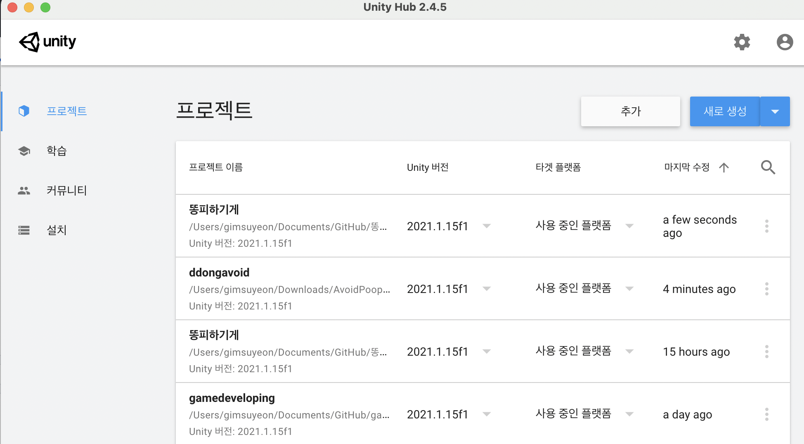
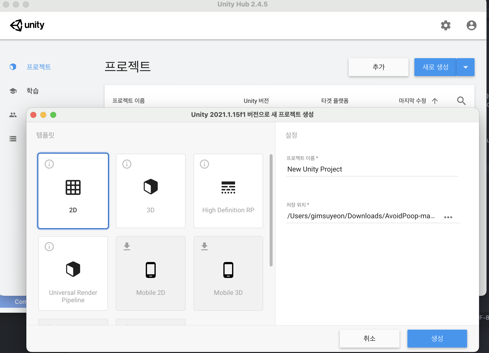

휴학도 했겠다, 실력을 늘리는 가장 최고의 방법은 직접 프로젝트를 해보는 것이라고 생각하기 때문에 간단한 미니게임이라도 혼자서 만들어보면서 UNITY실력을 올려야겠다는 생각을 했다. 아직 2D도 완전히 자유자재로 다루는 것도 아닐 뿐더라, 물리엔진까지 다루려면 갈 길이 멀다. github에 들어온지 4주 정도 된 것 같다. git태기라고 해야할까... 이제 다시 열심히 개발해보려고 한다. 아자아자!!

UNITY를 사용하는 사람이라면 누구나 그렇겠지만, 똑같은 아이콘이지만 흰색 배경인 UNITY HUB와 검은 배경인 UNITY 두 개 모두 설치되어 있어야 원활한 진행이 가능하다. 예전에 UNITY Hub가 없었을 시절에는 개발자가 일일이 설정해주는 과정이 필요했었다는데, 유니티 허브가 존재하는 시대에 개발할 수 있어서 얼마나 다행인지 모른다. 

유니티 허브(흰색 배경)에 들어가면 이렇게 진행중인 프로젝트를 볼 수 있고 오른쪽 상단에 있는 <b>추가</b>버튼을 통해서 새로운 프로젝트를 생성할 수 있다.

우리가 만들 똥피하기 게임은 단순한 2D게임이기 때문에 2D로 지정해 준 후 프로젝트를 만들어보자.

